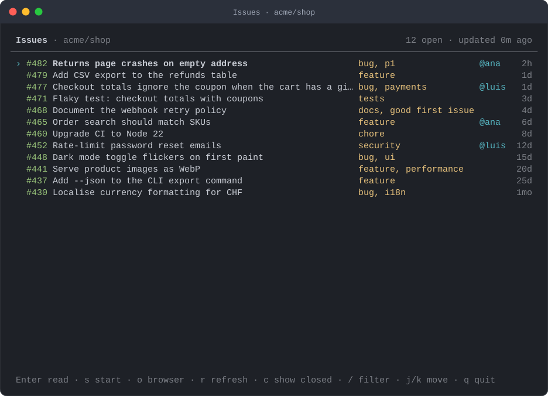
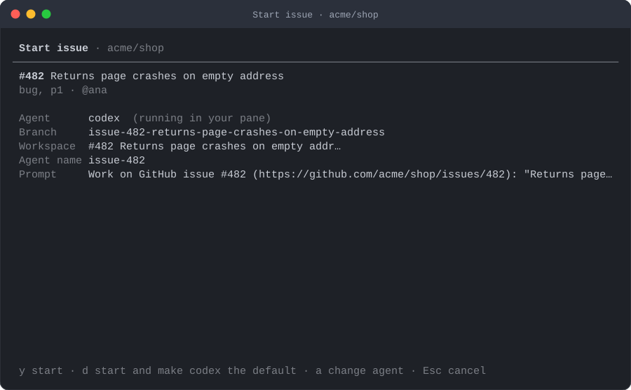
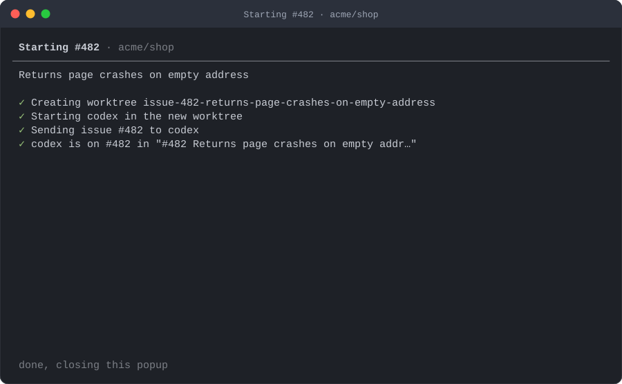
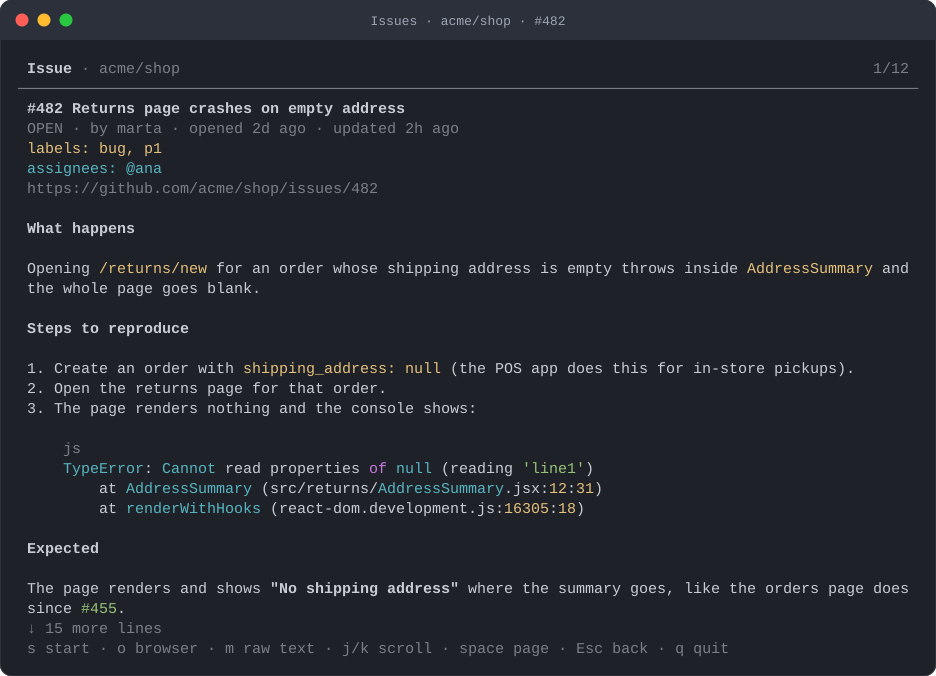

# herdr-issues

[](https://github.com/zamarrowski/herdr-issues/actions/workflows/ci.yml)
[](LICENSE)
[](https://herdr.dev)
[](package.json)

A [herdr](https://herdr.dev) plugin that shows the GitHub issues of the repository you are in, the
stories of your [Shortcut](https://shortcut.com) workspace and the issues of your
[Linear](https://linear.app) workspace, and hands any of them to a coding agent in its own git worktree. Claude Code, Codex, Gemini CLI, Pi, OpenCode,
Cursor, Copilot, Droid, Amp… whatever herdr can start, this plugin can hand an issue to.

<p align="center">
  
</p>

Press `s` on an issue, confirm, and watch it happen:

<table>
  <tr>
    <td width="50%"></td>
    <td width="50%"></td>
  </tr>
</table>

herdr creates a worktree on a branch named after the issue, opens it as a workspace, starts your agent
in it and types the issue URL into its input. The popup closes and you land in the new workspace with
the URL waiting in the agent: add whatever context you want and press Enter, or set `"submit": true`
in the config and let the plugin send it.

## What it does

- **Browse.** Open issues newest first, with labels, assignees and age, in four tabs: **All**,
  **GitHub** (the repository of your pane), **Shortcut** and **Linear** (your workspaces). The settings
  screen (`,`) decides which ones you see. `/` filters as you type, `c`
  includes closed issues, `Enter` shows the description and the comments rendered as Markdown
  (headings, lists, task lists, syntax-highlighted code blocks, quotes, links, `#123` and
  `@mentions`), `o` opens the issue in the browser. The last list is cached per repository so the popup paints instantly and
  refreshes behind.
- **Start.** One key turns an issue into a worktree, a herdr workspace and a running agent with the
  issue URL typed into its input, ready for your Enter. A confirmation screen shows exactly what is about
  to happen: agent, branch, workspace label, prompt.
- **Any agent.** By default the plugin uses the agent already running in the pane you opened the popup
  from. Otherwise it asks, with the list herdr supports. Set a default once, and choose how each agent
  starts: Claude Code in plan mode or skipping permissions, Codex without its sandbox, any extra
  arguments (`--add-dir …`).
- **Settings.** `,` in the popup (or `s` in the setup popup) shows or hides and reorders the tabs, sets
  the default agent and how each agent starts, and manages the Shortcut and Linear accounts. Changes
  are saved in `config.json` and apply at once.
- **Shortcut stories.** The Shortcut tab asks for an API token the first time and remembers it. Stories
  show their workflow state, tasks and comments, and start on an `sc-482-…` branch, which Shortcut links
  to the story. A story belongs to no repository, so the plugin asks where to work: any workspace open
  in herdr, with a worktree in a repository or a new tab in a workspace without git.
- **Linear issues.** The Linear tab works the same way with a personal API key. Issues show their
  state, priority, project, cycle, sub-issues and comments, and start on an `ENG-123-…` branch, which
  Linear links to the issue.
- **Ctrl+click.** Any GitHub issue URL, Shortcut story URL or Linear issue URL in any pane becomes a
  "start this" link.
- **Scriptable.** The same flow runs from a shell, a script or another agent: `start.mjs 482 --agent
  codex`, JSON output included.
- **Sidebar label.** The new workspace carries an `issue` token (`#482`, `sc-482`, `ENG-123`) you can show in the herdr sidebar.
- **One dependency.** [highlight.js](https://highlightjs.org) colours the code blocks; herdr fetches it
  when you install the plugin, and without it everything still works with plain code blocks. The rest is
  the Node.js standard library. GitHub through the `gh` CLI you already have, herdr through its own CLI.

## Requirements

- [herdr](https://herdr.dev) **0.9.0 or newer** (developed and tested on 0.9.1)
- **Node.js 20 or newer**, with `npm` (bundled) and network access at install time: herdr runs
  `npm ci` to fetch highlight.js
- **`gh`**, the [GitHub CLI](https://cli.github.com), logged in (`gh auth login`)
- **git**, and a local checkout of the repository (starting an issue creates a worktree of it)
- For Shortcut stories: a Shortcut API token (Shortcut → Settings → Your account → API Tokens). The
  Shortcut tab asks for it; `gh` is only needed for the GitHub side.
- For Linear issues: a Linear personal API key (Linear → Settings → Security & access → Personal API
  keys). The Linear tab asks for it.
- macOS or Linux

## Install

```sh
herdr plugin install zamarrowski/herdr-issues
```

herdr shows the source and the build command it is about to run (`npm ci`, which fetches highlight.js
for the code blocks) and asks before running it. Declining is fine: the plugin works the same, with
code blocks in plain text.

Then open the setup popup. It checks herdr, Node, `gh` and its login, and offers to add the
keybindings to your `config.toml` (with a backup) and to create a starter `config.json`:

```sh
herdr plugin action invoke zamarrowski.issues.setup
```

Prefer to edit the config yourself? Add this to `~/.config/herdr/config.toml` and run
`herdr server reload-config`. The default herdr prefix is `ctrl+b`:

```toml
[[keys.command]]
key = "prefix+i"
type = "plugin_action"
command = "zamarrowski.issues.open"
description = "github issues"

[[keys.command]]
key = "prefix+shift+i"
type = "plugin_action"
command = "zamarrowski.issues.start"
description = "start a github issue"
```

To update, reinstall. Your `config.json` lives outside the plugin directory and survives:

```sh
herdr plugin uninstall zamarrowski.issues && herdr plugin install zamarrowski/herdr-issues
```

For local development clone the repository and link it instead of installing:

```sh
git clone https://github.com/zamarrowski/herdr-issues.git
cd herdr-issues && npm ci && cd ..      # `plugin link` does not run the build step
herdr plugin link "$PWD/herdr-issues"
```

## Use

Open the popup with `ctrl+b` `i` or `herdr plugin action invoke zamarrowski.issues.open`. The GitHub
repository is inferred from the focused pane's directory (through `gh`, so forks and
`gh repo set-default` are honoured); outside a repository the GitHub tab says so and the other tabs
keep working.

The popup has four tabs, **All**, **GitHub**, **Shortcut** and **Linear**, and opens on the last one
you used. Hide the ones you do not want, or change their order, in the settings (`,`): the choice is
saved as `tabs` in `config.json`, for example `"tabs": ["github"]` for GitHub only, or
`"tabs": ["linear", "github"]` to have Linear first and no All or Shortcut tab.

### Browsing

| Key | Action |
| --- | --- |
| `Tab` / `Shift+Tab`, `1` `2` `3` `4` | switch tab |
| `j` `k` / arrows, `g` `G` | move |
| `Enter` / `l` | read the issue: description and comments (`j` `k` / `space` scroll, `m` raw text instead of rendered Markdown, `Esc` back) |
| `s` | **start** the issue (confirmation first) |
| `o` | open the issue in the browser |
| `/` | filter by number, title, label, assignee, author, state, story type or priority; `Esc` clears |
| `c` | include closed issues |
| `r` | refresh |
| `f` | people filter, remembered between popups: Shortcut owner / requester, Linear assignee / creator (their tabs, and both on All) |
| `,` | settings: tabs, default agent, how each agent starts, Shortcut and Linear accounts (see [Settings](#settings)) |
| `q` / `Esc` | quit |

Reading an issue renders its Markdown, code blocks included:

<p align="center">
  
</p>

### Shortcut

The first time you open the Shortcut tab it asks for an API token: create one in Shortcut under
Settings → Your account → API Tokens, paste it and press Enter. The plugin checks it against the API
(`@ana in acme`) and saves it in `secrets.json` in the plugin config directory, readable by you only.
From then on the tab lists the stories of the workspace that are not done or archived, newest updated
first, with their workflow state.

A whole workspace is usually too much, so `f` filters by **owner** and **requester**: pick *anyone*,
*me* or any member of the workspace (type to find them). The filter is part of the Shortcut search, so
nothing is lost to `limit`, and it is remembered: the next popup opens with the same filter (*me*
follows the token, whoever it belongs to). The header shows the active filter, and `x` on the filter
screen clears it.

`,` opens the settings; the Shortcut row under *Accounts* leads to the account, where `e` replaces the
token and `x` removes it.

If you already manage the token elsewhere, export `SHORTCUT_API_TOKEN` instead: it takes precedence
and the popup never asks. To list one team's stories only, or to change the search, set
`shortcut.team` or `shortcut.query` (see [docs/configuration.md](docs/configuration.md#shortcut)).

A story is linked to no repository, so starting one first asks where to work. The list holds every
workspace open in herdr, the workspace you opened the popup from preselected (press Enter to take it):

- a **repository** (listed once, whichever of its worktrees are open, and found with git even when
  herdr does not show it as one) gets a new worktree on `sc-482-<slug>`, which Shortcut's VCS
  integration attaches to the story, opened as a workspace, as for a GitHub issue;
- a **workspace that is not a git checkout** (marked *new tab*) gets a new tab, in the directory of
  its pane, with the agent and the prompt: no branch, nothing else changes in that workspace.

The prompt is the story URL, like for GitHub. An agent can only open it with access to Shortcut,
such as Shortcut's MCP server; see [docs/configuration.md](docs/configuration.md#shortcut) for a
prompt that works without it.

### Linear

The Linear tab works like the Shortcut one. The first time, it asks for a personal API key: create one
in Linear under Settings → Security & access → Personal API keys, paste it and press Enter. The plugin
checks it against the API (`@ana in acme`) and saves it in the same `secrets.json`. From then on the
tab lists the issues of the workspace that are not completed or canceled, newest updated first, with
their state; `c` adds the completed and canceled ones.

`f` filters by **assignee** and **creator** (*anyone*, *me* or any member), inside the Linear query, and
is remembered like the Shortcut filter. The Linear row of the settings (`,`) leads to the account (`e`
replaces the key, `x` removes it). `LINEAR_API_KEY`, when set, takes precedence and the popup never asks. To list one team's
issues only, set `linear.team` to its key (`ENG`); `linear.filter` adds conditions of your own, such as
a project or a priority (see [docs/configuration.md](docs/configuration.md#linear)).

Reading an issue shows its state, priority, project, cycle, estimate and parent, the description with
the sub-issues as a checklist, and the comments. Starting one asks where to work, like a story (a
repository gets a worktree, a workspace without git a new tab), and the branch is `ENG-123-<slug>`, which Linear's git integration links to the issue. Linear's own
branch name (`ana/eng-123-…`, what "Copy git branch name" gives you) is available as `{vcs_branch}`
if you would rather match it. The prompt is the issue URL; pair it with Linear's MCP server, or see
[docs/configuration.md](docs/configuration.md#linear) for a prompt that works without it.

### Starting

The confirmation screen shows the agent, the branch, the workspace label and the prompt (and where it
runs, for a story or a Linear issue; in a new tab there is no branch, and the label goes on the tab):

| Key | Action |
| --- | --- |
| `y` | start |
| `d` | start and save this agent as the default in `config.json` |
| `a` | choose another agent (arrows move, letters filter, `Enter` picks) |
| `r` | choose somewhere else to work (stories and Linear issues) |
| `Esc` | cancel |

When it finishes the popup closes and the new workspace is focused. If something fails, the failing
step is shown in red and any key takes you back.

### Ctrl+click an issue or story URL

Any `https://github.com/<owner>/<repo>/issues/<n>` link printed in a pane (a `gh` listing, an agent's
answer, a commit message) can be Ctrl+clicked: the start popup opens with the issue loaded. It has to
be an issue of the repository the pane is in; otherwise the popup says so. A
`https://app.shortcut.com/<workspace>/story/<id>` or `https://linear.app/<workspace>/issue/ENG-123` link
works the same way, and asks where to work.

The same popup opens from the `zamarrowski.issues.start` action (bound above to `prefix+shift+i`) and
asks for a number, `sc-<id>`, a Linear key such as `ENG-123`, or a URL.

### From a terminal or from an agent

Every popup has a plain command-line face when there is no TTY. `bin/run.sh` finds Node for you:

```sh
cd /path/to/herdr-issues        # or the directory `herdr plugin list` prints as plugin_root

sh bin/run.sh scripts/issues.mjs --cwd ~/code/shop                 # list open issues
sh bin/run.sh scripts/issues.mjs --cwd ~/code/shop --closed --json # everything, as JSON
sh bin/run.sh scripts/issues.mjs --source shortcut --owner me      # Shortcut stories (--source all: every tab)
sh bin/run.sh scripts/issues.mjs --source linear --assignee me     # Linear issues (--creator NAME|me too)
sh bin/run.sh scripts/start.mjs 482 --cwd ~/code/shop --agent codex
sh bin/run.sh scripts/start.mjs https://github.com/acme/shop/issues/482 --cwd ~/code/shop --no-agent   # worktree only
sh bin/run.sh scripts/start.mjs sc-482 --cwd ~/code/shop --agent claude   # a story, in the checkout of --cwd
sh bin/run.sh scripts/start.mjs ENG-123 --cwd ~/code/shop --agent claude  # a Linear issue, likewise
sh bin/run.sh scripts/setup.mjs --check                             # environment checks, exit 1 on failure
```

`--repo owner/name` (or `HERDR_ISSUES_REPO`) reads the issues of another repository; starting one still
needs a local checkout. Run any script with `--help` for its options.

## Choosing the agent

herdr knows how to start a fixed set of agents (`herdr agent` lists them: `claude`, `codex`, `gemini`,
`pi`, `opencode`, `cursor`, `copilot`, `droid`, `amp`, …). The plugin decides which one takes the issue in
this order:

1. `--agent <kind>` on the command line, or the agent you pick in the popup.
2. `agent` in `config.json`, or the `HERDR_ISSUES_AGENT` environment variable.
3. The agent running in the pane you opened the popup from.
4. Otherwise the popup asks (the command line refuses and tells you the options).

The default `"agent": "auto"` means "the agent I am already using". Press `d` on the confirmation
screen to make the chosen agent the default, or pick it in the settings (`,`).

### Settings

`,` opens the settings from any tab of the popup (on a Shortcut or Linear tab that asks for a token,
with the field empty), and `s` opens them in the setup popup. Every change is written to `config.json`
at once and applies in the open popup.

| Section | What you change | Keys |
| --- | --- | --- |
| Tabs | which tabs show, and their order (`tabs`) | `Enter` / `space` show or hide, `J` / `K` move |
| Agent | the default agent, or `auto` (`agent`) | `Enter` picks |
| How each agent starts | a mode and extra arguments per agent kind (`agent_args`) | `Enter` picks the mode, `e` types the extra arguments, `x` clears them |
| Accounts | the Shortcut and Linear accounts: replace or remove the token | `Enter` opens |

A **mode** is a named set of arguments. The plugin ships these, in `agent_modes`:

| Agent | Modes |
| --- | --- |
| `claude` | *accept edits*, *auto*, *plan* (`--permission-mode …`), *skip permissions (dangerous)* (`--dangerously-skip-permissions`) |
| `codex` | *read only*, *workspace write* (`--sandbox …`), *no sandbox, no approvals (dangerous)* (`--dangerously-bypass-approvals-and-sandbox`) |
| `gemini` | *auto edit* (`--approval-mode auto_edit`), *yolo (dangerous)* (`--yolo`) |

Picking one replaces the other modes of that agent in its `agent_args` and keeps your extra arguments;
*default* removes it. The confirmation screen shows the arguments and the mode before anything starts,
in red when the mode is dangerous. Any other agent (`+ another agent…`) takes extra arguments, and
`agent_modes` in `config.json` adds modes of your own ([docs/agents.md](docs/agents.md#modes)).

The settings write `agent_args`, which you can also edit by hand:

```json
{
  "agent": "codex",
  "agent_args": {
    "codex": ["--full-auto"],
    "claude": ["--add-dir", "../shared"]
  }
}
```

[docs/agents.md](docs/agents.md) has the details, including how startup dialogs are handled.

## Configuration

Optional. `config.json` lives in the plugin config directory, which
`herdr plugin config-dir zamarrowski.issues` prints (`~/.config/herdr/plugins/config/zamarrowski.issues/config.json`
on macOS and Linux). The settings screen (`,`) writes the common keys for you; for the rest, create it
from [`config.example.json`](config.example.json) with the setup popup (`c`) or by hand. Every key is optional; these are the defaults:

| Key | Default | What it does |
| --- | --- | --- |
| `tabs` | `["all", "github", "shortcut", "linear"]` | tabs of the popup, in this order |
| `agent` | `"auto"` | agent kind, or `auto` for the one in your pane |
| `agent_args` | `{}` | extra argv per agent kind, passed after `--` |
| `agent_modes` | see [Settings](#settings) | named argument sets per agent kind, offered by the settings |
| `agent_name` | `"issue-{number}"` | herdr agent name, so `herdr agent prompt issue-482 "…"` works later |
| `branch` | `"issue-{number}-{slug}"` | branch of the new worktree |
| `base` | `""` | base ref for the branch, e.g. `"origin/main"` (empty: herdr's default, the current HEAD) |
| `label` | `"{ref} {title}"` | workspace label, cut to `label_max` (`{ref}` is `#482`, `sc-482` or `ENG-123`) |
| `prompt` | `"{url}"` | what is typed into the agent |
| `submit` | `false` | press Enter for you; `false` leaves the prompt in the agent's input |
| `focus` | `true` | focus the new workspace |
| `notify` | `true` | herdr toast when the agent has the issue |
| `workspace_token` | `true` | publish `$issue` for the sidebar |
| `auto_accept_trust_prompt` | `true` | answer "trust this folder?" dialogs with Enter |
| `limit` | `100` | issues (and stories) to list, per source |
| `shortcut` | see below | `team`, `query`, and templates for stories: `branch` `sc-{number}-{slug}`, `agent_name` `sc-{number}` |
| `linear` | see below | `team`, `filter`, and templates for Linear issues: `branch` `{ref}-{slug}`, `agent_name` `{ref}` |

Templates accept `{number}` `{ref}` `{source}` `{title}` `{slug}` `{url}` `{repo}` `{owner}` `{name}` `{branch}` `{label}`
`{agent}` `{author}` `{labels}` `{vcs_branch}`. The full reference, with the timeouts and the environment variables, is
in [docs/configuration.md](docs/configuration.md).

## How starting works

Everything goes through the herdr CLI, so anything you could do by hand happens exactly the same way:

1. `herdr worktree create` on the current repository with branch `issue-<n>-<slug>` and label
   `#<n> <title>`. The checkout lands under herdr's `worktrees.directory` (default
   `~/.herdr/worktrees/<repo>/<branch>`) and opens as a workspace grouped under the repository's
   workspace. If the branch already exists, its worktree is opened instead. Your `worktree.created`
   hooks and plugins run as usual, so `.env` copying and dependency setup keep working.
2. `herdr agent start issue-<n> --kind <agent> --pane <new pane>`. If the agent shows a first-run
   dialog such as "do you trust the files in this folder?", the plugin accepts it and waits until the
   agent is idle.
3. `herdr pane send-text` types the rendered prompt, by default just the issue URL, into the agent's
   input and leaves it there: add context and press Enter. With `"submit": true` the plugin uses
   `herdr agent prompt` instead; herdr reports the keystrokes, not the turn, so the plugin then checks
   that the agent actually started working and re-sends Enter once if it did not.
4. A toast, and an `issue` token on the workspace.

The agent is named `issue-<n>`, so you can talk to it later from any pane:

```sh
herdr agent read issue-482 --lines 80
herdr agent prompt issue-482 "Also add a regression test."
```

If a worktree for the issue is already open, the plugin focuses it and leaves its pane alone.

## Sidebar label

Each workspace created by the plugin carries an `issue` token (`#482`, `sc-482` for a story, `ENG-123` for a Linear issue). Show it by adding `$issue` to
your space rows in `config.toml` (this is herdr's default layout with the token appended; merge it into
your own rows if you have customised them), then `herdr server reload-config`:

```toml
[ui.sidebar.spaces]
rows = [
  ["state_icon", "workspace"],
  ["branch", "git_status", "$issue"],
]
```

## Data and privacy

- Nothing leaves your machine except the `gh` calls that list and read issues, the Shortcut and Linear
  API calls that list and read stories and issues, and, when you press `o`, opening the issue in your
  browser.
- GitHub: no token is read or stored; `gh` uses its own login.
- Shortcut: the token you type in the Shortcut tab is saved in `secrets.json` in the plugin config
  directory (`~/.config/herdr/plugins/config/zamarrowski.issues/secrets.json`) with mode `0600`, apart from
  `config.json` so the config can be shared. It is sent only to `api.app.shortcut.com`, in the
  `Shortcut-Token` header, and is never cached, logged or printed. `SHORTCUT_API_TOKEN` takes precedence
  and is never written anywhere. `x` in the Shortcut settings deletes the saved token.
- Linear: the same, for the API key you type in the Linear tab. It is saved in the same `secrets.json`,
  sent only to `api.linear.app` in the `Authorization` header, and never cached, logged or printed.
  `LINEAR_API_KEY` takes precedence and is never written anywhere.
- Installing runs `npm ci`, which downloads highlight.js (and nothing else) from the npm registry,
  pinned by `package-lock.json`. The plugin never talks to the registry afterwards.
- The issue list is cached per repository, and the Shortcut and Linear lists per team and filter, with titles and
  metadata only, in the plugin state directory
  (`~/.local/state/herdr/plugins/zamarrowski.issues/issues/`). Delete it whenever you like.
- The plugin never edits your herdr `config.toml` unless you press `k` in the setup popup or run
  `setup.mjs --write-keys`; it then keeps a one-time backup next to it.

## Troubleshooting

`herdr plugin log list --plugin zamarrowski.issues` shows the output of every action the plugin ran, and
the setup popup (`herdr plugin action invoke zamarrowski.issues.setup`) runs the environment checks.

- **"Shortcut rejected the token"** — the token was revoked or mistyped. `,` on the Shortcut tab and
  `e` replaces it; if it comes from `SHORTCUT_API_TOKEN`, fix it there.
- **A story is missing** — the Shortcut tab shows stories that are not done or archived (`c` adds done
  ones), up to `limit`, filtered by `shortcut.team` and `shortcut.query` when you set them.
- **"Linear rejected the API key"** — the key was revoked or mistyped. `,` on the Linear tab and `e`
  replaces it; if it comes from `LINEAR_API_KEY`, fix it there.
- **A Linear issue is missing** — the Linear tab shows issues that are not completed or canceled (`c`
  adds them), up to `limit`, of `linear.team` when you set it and matching `linear.filter`. The setup
  popup lists the team keys when `linear.team` matches none.
- **"… is not inside a git repository"** — the popup uses the focused pane's directory. Open it from a
  pane inside the checkout, or pass `--cwd`.
- **"gh: not logged in" / "could not resolve to a Repository"** — run `gh auth login`, and check that
  `gh repo view` works in that directory. For forks, `gh repo set-default` decides which repository's
  issues you see.
- **"Node.js 20 or newer is required"** — `bin/run.sh` looks in PATH and the usual install locations.
  Point `HERDR_ISSUES_NODE` at your `node` binary if it lives somewhere unusual (nvm, asdf, mise).
- **The agent never became ready** — herdr detected the agent but it stayed blocked on a dialog the
  plugin does not recognise. Look at its pane, answer the dialog, then send the prompt yourself with
  `herdr agent prompt issue-<n> "…"`. Extend `trust_prompt_pattern` in `config.json` so it is accepted
  next time, and please [open an issue](https://github.com/zamarrowski/herdr-issues/issues) with the
  agent and the text of the dialog.
- **Code blocks have no colours** — highlight.js is not installed: the build step was declined, or the
  plugin was linked from a checkout without `npm ci`. Run `npm ci` in the plugin directory
  (`herdr plugin list` prints it as `plugin_root`) or reinstall. The setup popup shows which it is.
- **"ui_busy"** — herdr cannot open a popup while Settings, copy mode or another modal is active.
- **Keybinding does nothing** — `herdr server reload-config` after editing `config.toml`; `prefix+?`
  lists the active bindings.

## Uninstall

```sh
herdr plugin uninstall zamarrowski.issues            # or `herdr plugin unlink zamarrowski.issues` for a linked checkout
```

Remove the `# >>> zamarrowski.issues` block from `config.toml` (the setup popup's `u` does it), and
delete `~/.config/herdr/plugins/config/zamarrowski.issues` (it holds `config.json` and the saved
Shortcut token and Linear key) and
`~/.local/state/herdr/plugins/zamarrowski.issues` if you want no trace left.

## Contributing

Bug reports, agent quirks and pull requests are welcome. See [CONTRIBUTING.md](CONTRIBUTING.md) for
the development setup (`herdr plugin link .`, `npm test`), the code style and how to add support for an
agent's startup dialog. This project follows the [Contributor Covenant](CODE_OF_CONDUCT.md).

## License

[MIT](LICENSE) © Sergio Zamarro
