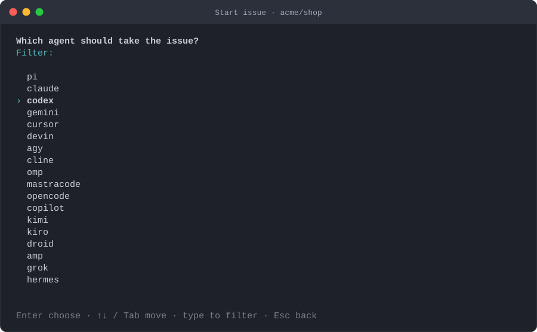

# Agents

herdr-issues does not know anything specific about Claude Code, Codex or any other agent. It only
knows herdr, and herdr knows how to start, detect and talk to a set of agents. This document explains
what that means in practice and how to adapt the plugin when an agent behaves differently.

## Which agents

`herdr agent` prints the kinds your herdr can start. On herdr 0.9.1:

```
pi claude codex gemini cursor devin agy cline omp mastracode opencode copilot kimi kiro droid amp
grok hermes kilo qodercli qwen letta maki muse
```

The plugin reads that list at runtime (falling back to the list above), so a newer herdr with more
agents needs no plugin update. The agent's own binary must be installed and on your PATH: herdr runs
it in the new pane's shell.

## Which one takes the issue

Highest precedence first:

1. `--agent <kind>` on the command line, or the agent picked in the popup (`a` on the confirmation
   screen, or the picker that opens when nothing else decided).
2. `agent` in `config.json`, or `HERDR_ISSUES_AGENT`, unless it is `"auto"`.
3. The agent running in the pane the popup was opened from (herdr reports it as
   `focused_pane_agent` in the plugin context).
4. Nothing: the popup asks; the command line exits with an error that lists the options.

Press `d` instead of `y` on the confirmation screen to save the current choice as `agent` in
`config.json`.

<p align="center">
  
</p>

## Extra arguments

`agent_args` in `config.json` maps a kind to an array of arguments. herdr passes them to the agent
after `--`, exactly as `herdr agent start … -- <args>` would:

```json
{
  "agent_args": {
    "codex": ["--full-auto"],
    "claude": ["--add-dir", "../shared", "--model", "opus"],
    "gemini": ["--yolo"]
  }
}
```

The plugin does not validate them. Check your agent's `--help`.

## Startup dialogs

`herdr agent start` returns once herdr has detected the agent and considers it ready for input. Some
agents first ask a question in a new directory, typically whether you trust the folder. herdr then
reports the agent as *blocked* and the start fails with `agent_not_ready`.

When that happens the plugin:

1. Waits up to `timeouts.agent_ready_ms` for the agent to become idle.
2. Reads the agent's visible screen (`herdr agent read`). If `auto_accept_trust_prompt` is on and the
   text matches `trust_prompt_pattern`, it presses Enter, which accepts the highlighted default answer.
3. Repeats up to four times, then gives up with "the agent started but never became ready for input".

The default pattern covers the wording seen in Claude Code ("Do you trust the files in this folder?",
"Yes, proceed") and the generic "trust this folder / directory / workspace / repository" forms other
agents use:

```
trust the files|trust this (folder|directory|workspace|repository)|do you trust|yes, proceed
```

If your agent asks something else, extend the pattern (it is a case-insensitive JavaScript regular
expression), or set `auto_accept_trust_prompt` to `false` and answer yourself. In both cases please
[open an issue](https://github.com/zamarrowski/herdr-issues/issues/new?template=agent_quirk.yml) with the
agent, its version and the exact text, so the default can cover it.

Only Enter is ever sent, and only while the agent is blocked on a screen that matches the pattern.
The plugin never answers permission prompts for tool calls: herdr's `agent prompt` refuses to type
into a blocked agent, and the plugin does not work around that.

## Delivering the prompt

By default the plugin types the prompt (just the issue URL) into the agent's input with
`herdr pane send-text` and stops there. You land in the new workspace with the URL waiting: add
context, or nothing, and press Enter. Nothing is sent on your behalf, which also means the agent never
starts a turn you did not see.

With `"submit": true` the plugin uses `herdr agent prompt`, which writes the text and Enter through
the pane's bracketed-paste mode and reports success when both were written. That is not proof that the
agent started a turn, so the plugin then waits `timeouts.submit_check_ms` for the agent to become
*working* or *blocked*. If nothing happens (an agent redraw can swallow the Enter), it sends Enter once
more and checks again. The result is reported as "sent, the agent is working" or "sent but not
confirmed"; in the second case the prompt is in the agent's input box, waiting for your Enter.

## Talking to the agent later

The agent is named from `agent_name` (`issue-482` by default). From any pane:

```sh
herdr agent list
herdr agent read issue-482 --source recent-unwrapped --lines 120
herdr agent prompt issue-482 "When you are done, open a PR with gh." --wait --timeout 600000
```

Names must be unique among live agents; when `issue-482` is taken (a second worktree for the same
issue, for example) the plugin appends a short suffix and tells you the name it used.

## Notes per agent

These are observations, not requirements; the flow is identical for all of them.

- **Claude Code** asks to trust the folder the first time it runs in a directory it has not seen. The
  default pattern accepts it. `agent_args` such as `--add-dir` or `--model` work as usual.
- **Codex** and **Gemini CLI** also have first-run confirmations in new directories; their wording is
  covered by the generic forms of the pattern. Report the exact text if yours is not.
- **Pi**, **OpenCode**, **Cursor**, **Copilot** and the rest: start normally through `herdr agent start`.
  If herdr can detect the agent (`herdr agent explain <pane>` tells you), the plugin can prompt it.

If an agent needs something the flow does not offer, `agent_args` and the prompt template are the
first two knobs; the third is a pull request.
